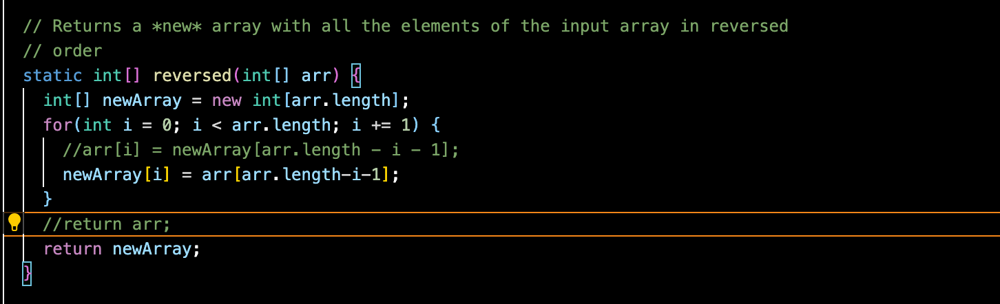

# Lab 3 Report
***
## Simplest Searching Engine

Since the there is no argument and so the length of the argument is 0, it will return "Missing port number! Try any number between 1024 to 49151" when it runs the main method and meets the first if statement.

For all the pictures, handleRequest of HandleStr is called.\
For this one, the first element of args is 28494 and thus, the value of port is 28494. Then port and a new created HandlerStr object are passes to the start() method of Server as arguments. In start(), server is created by a built-in method in java and port is used for creating an InetSocketAddress to create server. Then, server.createContext("/", new ServerHttpHandler(handler)); is called. handler is the new created HandleStr object passing to start(). handleRequest is also called somewhere in the program (I think it is ServerHttpHandler.handle, but I don't know where ServerHttpHandler.handle is called. perhaps in some built-in method). Since the path is "/", so the first if applies here and returns "String:" and "".

For this one, the methods called are the same, but the path in the browser is changed to "/add" followed by a query "?=hello". Since now it doesn't fit the first it, it goes to else and finds that it fits the first if in the else and the if inside the if because it has "/add" in its path and its query starts with s. Therefore, returns the thing shown. We can see the words in the browser change after pressing enter after making the change.

For this one, the query on the browser is changed to "=hello". Though it contains "'add" in its path and so fits the first if in else, its query doesn't start with "s" and so doesn't fit the if inside the if. Thus it keeps going and finally returns "404 not found". We can see the words in the browser change after pressing enter after making the change.

***
## Set Up
 I have seen -cp and JUnit in my CSE 12 class when I try to run my code. I tested by using the tester in CSE 11. It is written as “import tester.*” and “void testName(Tester t) {t.(checkExpect(actual value, expected value);}”. But I haven’t written tests in a different language.
## Symptoms and Failure-inducing inputs
**Array Methods**

The failure input is an integer list {1, 2}. The symptom is that its output is {2, 2} instead of {2, 1}. The bug is in the for loop. Since it goes through the whole list and uses "arr[i] = arr[arr.length - i - 1];". For the front half part of the list, it gets the right value from the back half of the list, but for the back half of the list, when they get the value from the front half list, they are actually getting the value of their own. The method will return the mirror of the list instead of the inverse.
Any input that is not symmetric may cause the failure. The symptom is that it returns the mirror of the list instead of the inverse.\
To correct the code, I change it to the code shown below.

***

The failure-inducing input is an integer list {1}. The symptom is that the output is {0} instead of {1}. The bug is that it uses “arr[i] = newArray[arr.length - i - 1];” in the for loop and returns arr at last. It makes the origin array a reverse of the new created array and returns the origin array at last.\
Any input that is not a list with only 0s can cause the failure. The symptom is that it returns a list with all elements set to 0.\
To correct the code, I change it to the code shown below.

***

The failure-inducing input is a double list {1, 1, 1, 2, 3}. The symptom is that the output is 1.25 instead of 1.75. It is caused by “if(num != lowest) { sum += num; }” in the for loop. It leads that if there are more than 1 item having the lowest value, then none of them would be added to the sum.\
Any input that has more than one lowest value will induce a failure. The symptom is that one would get a result calculated by (sum-all lowest values)/(number of items-1).\
To correct the code, I change it to the code shown below.

***
***
**List Methods**\
I didn't find any checkString method implementing StringChecker, so I add 1 to the ListExamples.java.
***

The failure-inducing input is a arraylist containing three string "apple", "hi" and "banana". Any arraylist containg elements that checkString returns true and these elements are not symmetric would cause a failure. The symptom is printing out "banana" and "apple", which is the reverse of the right output. The bug is "result.add(0, s);". It keeps adding items to the 0 index.
There is my correction.

***

The failure-inducing input is an arraylist with "a", "b" in it and an arraylist with "c", "d" in it. Any input that the item in the second argument should be the last item of the new arraylist would casue the failure. The symptom is not shown, but I guess the method would never need because there is a bug "index1 += 1;". Thus, index2 will always be smaller than the size of list2 and the loop will never end.\
There is my correction.

***
**Linked List Methods**

The failure-inducing input is append the third node to the linked list. Appending nodes when two or more than two nodes exist in the linked list will cause an error. The symptom is not shown in the terminal, but I think there is a loop that never ends. The bug is in the last loop. Since the node is added to the current node in the last loop, the next of the node can never be null and the loop keep going.
THere is the correction.

I click new file in the left to make the two new jave file. It is easy and quickly. To shorten the time used, I copy and paste the import part and in the terminal and I use the up arrow a lot to compile and run quickly.
***
**File Methods**

The failure inducing input is shown in the picture. Any directory input with other directories in it will lead to error. The symptom is that it only prints out the current directory and the the files inside it. The bug is that the argument is added to the list and there is a loop adding the files under is to the list.
There is the correction.
